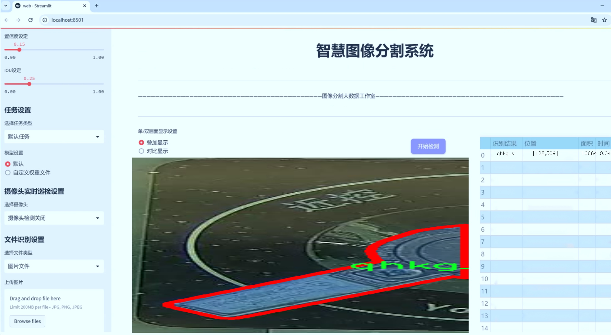
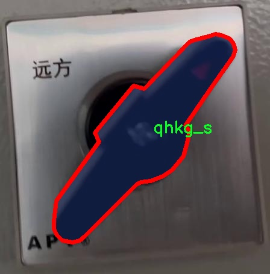

# 旋钮开关图像分割系统： yolov8-seg-LSKNet

### 1.研究背景与意义

[参考博客](https://gitee.com/YOLOv8_YOLOv11_Segmentation_Studio/projects)

[博客来源](https://kdocs.cn/l/cszuIiCKVNis)

研究背景与意义

随着智能设备的普及，旋钮开关作为一种常见的用户交互界面，广泛应用于家电、汽车、工业设备等多个领域。旋钮开关的设计与功能直接影响用户体验，因此在其生产和使用过程中，准确识别和分割旋钮开关的图像信息显得尤为重要。传统的图像处理方法在处理复杂背景和多变光照条件下的旋钮开关图像时，往往难以达到理想的效果。为此，基于深度学习的图像分割技术逐渐成为研究的热点，其中YOLO（You Only Look Once）系列模型因其高效性和准确性受到广泛关注。

YOLOv8作为YOLO系列的最新版本，结合了更为先进的网络结构和优化算法，能够在实时性和精度之间取得良好的平衡。然而，针对特定应用场景，如旋钮开关的图像分割，YOLOv8的标准模型可能无法充分发挥其潜力。因此，改进YOLOv8以适应旋钮开关图像分割的需求，不仅可以提升分割精度，还能提高系统的鲁棒性和实时性，从而为智能设备的交互设计提供更为可靠的技术支持。

本研究所使用的数据集包含2400张旋钮开关的图像，涵盖了多种不同的拍摄角度和背景环境，确保了数据的多样性和代表性。该数据集的类别数量为1，专注于“qhkg_s”这一特定旋钮开关类型，使得模型训练能够集中于该类目标的特征提取与分割。这种专注性不仅有助于提高模型的训练效率，还能有效减少过拟合的风险，确保模型在实际应用中的泛化能力。

通过对YOLOv8模型的改进，研究将重点探索如何在旋钮开关图像分割任务中引入更为有效的特征提取机制、优化损失函数以及增强数据增强策略等。具体而言，改进的方向可能包括引入注意力机制以提升模型对旋钮开关细节的关注，或通过改进的网络结构来提高模型对复杂背景的适应能力。此外，研究还将探讨如何通过迁移学习等方法，利用已有的图像分割模型加速训练过程，提升模型的性能。

本研究的意义不仅在于提升旋钮开关图像分割的技术水平，更在于为智能设备的用户体验优化提供理论与实践支持。通过实现高效、准确的旋钮开关图像分割，能够为后续的智能控制系统、自动化检测以及人机交互界面的设计提供重要的数据基础和技术保障。同时，该研究也为深度学习在特定领域的应用提供了新的思路，推动了图像分割技术的进一步发展。总之，基于改进YOLOv8的旋钮开关图像分割系统的研究，不仅具有重要的学术价值，也为实际应用提供了切实可行的解决方案。

### 2.图片演示





注意：本项目提供完整的训练源码数据集和训练教程,由于此博客编辑较早,暂不提供权重文件（best.pt）,需要按照6.训练教程进行训练后实现上图效果。

### 3.视频演示

[3.1 视频演示](https://www.bilibili.com/video/BV17QmRYCEs6/)

### 4.数据集信息

##### 4.1 数据集类别数＆类别名

nc: 1
names: ['qhkg_s']


##### 4.2 数据集信息简介

数据集信息展示

在本研究中，我们使用了名为“switch segmentation”的数据集，以训练和改进YOLOv8-seg模型，专注于旋钮开关的图像分割任务。该数据集的设计旨在为旋钮开关的自动识别和分割提供高质量的图像数据，进而提升计算机视觉系统在实际应用中的性能和准确性。数据集包含了多种旋钮开关的图像，经过精心标注，以确保每个图像中的目标物体能够被准确识别和分割。

“switch segmentation”数据集的类别数量为1，具体类别为“qhkg_s”。这一类别代表了一种特定类型的旋钮开关，涵盖了该类型旋钮开关的多种外观和形态。数据集中的图像样本经过严格筛选，确保其在不同的环境和光照条件下都能展现出旋钮开关的特征。这种多样性不仅有助于模型的训练，还能提高其在实际应用中的鲁棒性。

数据集的图像来源于多个场景，包括室内和室外环境，确保了模型在不同背景下的适应能力。每张图像都经过精确的标注，标注过程采用了先进的图像处理技术，确保分割边界的准确性。这对于YOLOv8-seg模型的训练至关重要，因为高质量的标注能够显著提高模型的学习效果，使其能够更好地理解旋钮开关的形状、颜色和纹理等特征。

在数据集的构建过程中，我们还考虑到了图像的多样性，包括不同的拍摄角度、距离和背景。这种多样性不仅增强了数据集的代表性，还为模型提供了丰富的训练样本，使其能够学习到旋钮开关在各种条件下的表现。这种全面的训练数据能够帮助模型在面对未见过的样本时，依然保持较高的识别和分割精度。

此外，为了确保数据集的有效性和可靠性，我们对数据集进行了严格的质量控制。每个图像在标注后都经过复核，确保没有标注错误或遗漏。这一过程不仅提高了数据集的整体质量，也为后续的模型训练提供了坚实的基础。经过多轮的验证和调整，我们最终确定了数据集的最终版本，确保其在训练YOLOv8-seg模型时能够发挥最大的效用。

综上所述，“switch segmentation”数据集为旋钮开关图像分割系统的开发提供了宝贵的资源。通过精心设计和严格的标注过程，该数据集不仅涵盖了丰富的样本类型，还确保了高质量的标注信息，为YOLOv8-seg模型的训练提供了强有力的支持。随着模型的不断优化和改进，我们期待这一数据集能够在旋钮开关的自动识别和分割任务中发挥重要作用，推动相关领域的研究和应用进展。




### 5.项目依赖环境部署教程（零基础手把手教学）

[5.1 环境部署教程链接（零基础手把手教学）](https://www.bilibili.com/video/BV1jG4Ve4E9t/?vd_source=bc9aec86d164b67a7004b996143742dc)


[5.2 安装Python虚拟环境创建和依赖库安装视频教程链接（零基础手把手教学）](https://www.bilibili.com/video/BV1nA4VeYEze/?vd_source=bc9aec86d164b67a7004b996143742dc)

### 6.手把手YOLOV8-seg训练视频教程（零基础手把手教学）

[6.1 手把手YOLOV8-seg训练视频教程（零基础小白有手就能学会）](https://www.bilibili.com/video/BV1cA4VeYETe/?vd_source=bc9aec86d164b67a7004b996143742dc)


按照上面的训练视频教程链接加载项目提供的数据集，运行train.py即可开始训练



     Epoch   gpu_mem       box       obj       cls    labels  img_size
     1/200     0G   0.01576   0.01955  0.007536        22      1280: 100%|██████████| 849/849 [14:42<00:00,  1.04s/it]
               Class     Images     Labels          P          R     mAP@.5 mAP@.5:.95: 100%|██████████| 213/213 [01:14<00:00,  2.87it/s]
                 all       3395      17314      0.994      0.957      0.0957      0.0843

     Epoch   gpu_mem       box       obj       cls    labels  img_size
     2/200     0G   0.01578   0.01923  0.007006        22      1280: 100%|██████████| 849/849 [14:44<00:00,  1.04s/it]
               Class     Images     Labels          P          R     mAP@.5 mAP@.5:.95: 100%|██████████| 213/213 [01:12<00:00,  2.95it/s]
                 all       3395      17314      0.996      0.956      0.0957      0.0845

     Epoch   gpu_mem       box       obj       cls    labels  img_size
     3/200     0G   0.01561    0.0191  0.006895        27      1280: 100%|██████████| 849/849 [10:56<00:00,  1.29it/s]
               Class     Images     Labels          P          R     mAP@.5 mAP@.5:.95: 100%|███████   | 187/213 [00:52<00:00,  4.04it/s]
                 all       3395      17314      0.996      0.957      0.0957      0.0845


### 7.50+种全套YOLOV8-seg创新点加载调参实验视频教程（一键加载写好的改进模型的配置文件）

[7.1 50+种全套YOLOV8-seg创新点加载调参实验视频教程（一键加载写好的改进模型的配置文件）](https://www.bilibili.com/video/BV1Hw4VePEXv/?vd_source=bc9aec86d164b67a7004b996143742dc)

### YOLOV8-seg算法简介

原始YOLOV8-seg算法原理

YOLOv8-seg算法是YOLO系列中最新的目标检测与分割模型，它在目标检测的基础上，进一步扩展了图像分割的能力。相较于之前的YOLOv5，YOLOv8-seg在精度和速度上都实现了显著的提升，展现出更为强大的特征提取和处理能力。该算法的设计理念是通过优化网络结构和算法流程，以适应不同应用场景的需求，同时保持实时性和高效性。

YOLOv8-seg的网络结构主要由输入端、骨干网络、颈部网络和头部网络四个部分组成。输入端的设计尤为重要，它通过马赛克数据增强、自适应锚框计算和自适应灰度填充等技术，确保输入图像在经过处理后能够更好地适应后续的特征提取过程。马赛克数据增强通过对图像进行拼接和变换，增加了数据的多样性，从而提升了模型的泛化能力。自适应锚框计算则通过分析输入数据的特征，动态调整锚框的大小和数量，以提高目标检测的准确性。

在骨干网络部分，YOLOv8-seg采用了C2f模块和SPPF结构。C2f模块是对残差特征进行学习的主要模块，其设计灵感来源于YOLOv7的ELAN结构。C2f模块通过引入更多的分支和跨层连接，显著增强了模型的梯度流动性，使得特征表示能力得到了极大的提升。SPPF结构则通过空间金字塔池化的方式，处理多尺度特征，进一步提高了特征提取的效率。这种结构的优势在于，它能够有效地捕捉到不同尺度的目标信息，确保在复杂场景下也能保持良好的检测性能。

颈部网络采用了路径聚合网络（PAN）结构，这一设计使得不同尺度的特征能够更好地融合。PAN通过多层次的特征传递和聚合，增强了模型对小目标和大目标的检测能力。这一特性在实际应用中尤为重要，因为在许多场景下，目标的大小差异可能会导致检测效果的显著不同。通过这种结构，YOLOv8-seg能够有效地处理各种尺度的目标，提高了整体的检测精度。

头部网络是YOLOv8-seg的关键部分，它将分类和检测过程进行了解耦。通过将目标检测的回归和分类损失分开计算，YOLOv8-seg能够更灵活地调整模型的学习策略。在损失计算方面，YOLOv8-seg采用了Task-Aligned Assigner分配策略，根据分类与回归的分数加权结果选择正样本。这种策略能够有效地提升模型对目标的检测能力，确保在复杂背景下也能准确识别目标。

在目标分割方面，YOLOv8-seg通过引入全卷积网络（FCN）结构，实现了对目标的精确分割。该结构通过对特征图进行逐像素的分类，能够生成高质量的分割掩码。YOLOv8-seg的分割能力不仅限于简单的前景与背景分离，还能够处理复杂的场景，识别多个重叠目标。这一特性使得YOLOv8-seg在自动驾驶、医学影像分析等领域展现出广泛的应用潜力。

YOLOv8-seg的另一个显著特点是其高效的无锚框检测方式。与传统的锚框检测方法不同，YOLOv8-seg直接预测目标的中心点和宽高比例，减少了锚框的数量。这一设计不仅提高了检测速度，还简化了模型的复杂性，使得YOLOv8-seg在实时应用中表现得更加出色。此外，YOLOv8-seg还引入了分布焦点损失和完全交并比损失函数，以提升模型对边界框预测的精准性。这些创新的损失函数设计，使得模型在训练过程中能够更好地适应不同类型的目标，进一步提升了检测和分割的效果。

总的来说，YOLOv8-seg算法通过对网络结构的深度优化和算法流程的创新，成功地将目标检测与分割能力结合在一起。其高效的特征提取、灵活的损失计算、无锚框检测方式以及强大的多尺度特征融合能力，使得YOLOv8-seg在实际应用中具备了极高的准确性和实时性。这一算法的成功，不仅为目标检测和分割领域带来了新的突破，也为未来的研究和应用提供了新的思路和方向。随着YOLOv8-seg的不断发展和完善，我们有理由相信，它将在更多的实际场景中发挥重要作用，推动计算机视觉技术的进一步进步。


### 9.系统功能展示（检测对象为举例，实际内容以本项目数据集为准）

图9.1.系统支持检测结果表格显示

  图9.2.系统支持置信度和IOU阈值手动调节

  图9.3.系统支持自定义加载权重文件best.pt(需要你通过步骤5中训练获得)

  图9.4.系统支持摄像头实时识别

  图9.5.系统支持图片识别

  图9.6.系统支持视频识别

  图9.7.系统支持识别结果文件自动保存

  图9.8.系统支持Excel导出检测结果数据


### 10.50+种全套YOLOV8-seg创新点原理讲解（非科班也可以轻松写刊发刊，V11版本正在科研待更新）

#### 10.1 由于篇幅限制，每个创新点的具体原理讲解就不一一展开，具体见下列网址中的创新点对应子项目的技术原理博客网址【Blog】：


[10.1 50+种全套YOLOV8-seg创新点原理讲解链接](https://gitee.com/qunmasj/good)

#### 10.2 部分改进模块原理讲解(完整的改进原理见上图和技术博客链接)【如果此小节的图加载失败可以通过CSDN或者Github搜索该博客的标题访问原始博客，原始博客图片显示正常】
### CBAM空间注意力机制
近年来，随着深度学习研究方向的火热，注意力机制也被广泛地应用在图像识别、语音识别和自然语言处理等领域，注意力机制在深度学习任务中发挥着举足轻重的作用。注意力机制借鉴于人类的视觉系统，例如，人眼在看到一幅画面时，会倾向于关注画面中的重要信息，而忽略其他可见的信息。深度学习中的注意力机制和人类视觉的注意力机制相似，通过扫描全局数据，从大量数据中选择出需要重点关注的、对当前任务更为重要的信息，然后对这部分信息分配更多的注意力资源，从这些信息中获取更多所需要的细节信息，而抑制其他无用的信息。而在深度学习中，则具体表现为给感兴趣的区域更高的权重，经过网络的学习和调整，得到最优的权重分配，形成网络模型的注意力，使网络拥有更强的学习能力，加快网络的收敛速度。
注意力机制通常可分为软注意力机制和硬注意力机制[4-5]。软注意力机制在选择信息时，不是从输入的信息中只选择1个，而会用到所有输入信息，只是各个信息对应的权重分配不同，然后输入网络模型进行计算;硬注意力机制则是从输入的信息中随机选取一个或者选择概率最高的信息，但是这一步骤通常是不可微的，导致硬注意力机制更难训练。因此，软注意力机制应用更为广泛，按照原理可将软注意力机制划分为:通道注意力机制（channel attention)、空间注意力机制(spatial attention）和混合域注意力机制(mixed attention)。
通道注意力机制的本质建立各个特征通道之间的重要程度，对感兴趣的通道进行重点关注，弱化不感兴趣的通道的作用;空间注意力的本质则是建模了整个空间信息的重要程度，然后对空间内感兴趣的区域进行重点关注，弱化其余非感兴趣区域的作用;混合注意力同时运用了通道注意力和空间注意力，两部分先后进行或并行，形成对通道特征和空间特征同时关注的注意力模型。

卷积层注意力模块(Convolutional Block Attention Module，CBAM）是比较常用的混合注意力模块，其先后集中了通道注意力模块和空间注意力模块，网络中加入该模块能有效提高网络性能，减少网络模型的计算量，模块结构如图所示。输入特征图首先经过分支的通道注意力模块，然后和主干的原特征图融合，得到具有通道注意力的特征图，接着经过分支的空间注意力模块，在和主干的特征图融合后，得到同时具有通道特征注意力和空间特征注意力的特征图。CBAM模块不改变输入特征图的大小，因此该模块是一个“即插即用”的模块，可以插入网络的任何位置。

通道注意力模块的结构示意图如图所示，通道注意力模块分支并行地对输入的特征图进行最大池化操作和平均池化操作，然后利用多层感知机对结果进行变换，得到应用于两个通道的变换结果，最后经过sigmoid激活函数将变换结果融合，得到具有通道注意力的通道特征图。

空间注意力模块示意图如图所示，将通道注意力模块输出的特征图作为该模块的输入特征图，首先对输入特征图进行基于通道的最大池化操作和平均池化操作，将两部分得到的结果拼接起来，然后通过卷积得到降为Ⅰ通道的特征图，最后通过sigmoid激活函数生成具有空间注意力的特征图。


### 11.项目核心源码讲解（再也不用担心看不懂代码逻辑）

#### 11.1 ultralytics\utils\metrics.py

以下是经过简化和注释的代码，保留了核心部分，并对每个函数进行了详细的中文注释：

```python
import numpy as np
import torch

def box_iou(box1, box2, eps=1e-7):
    """
    计算两个边界框之间的交并比（IoU）。
    
    参数：
        box1 (torch.Tensor): 形状为 (N, 4) 的张量，表示 N 个边界框。
        box2 (torch.Tensor): 形状为 (M, 4) 的张量，表示 M 个边界框。
        eps (float, optional): 避免除以零的小值。默认值为 1e-7。

    返回：
        (torch.Tensor): 形状为 (N, M) 的张量，包含 box1 和 box2 之间的逐对 IoU 值。
    """
    # 获取边界框的坐标
    (a1, a2), (b1, b2) = box1.unsqueeze(1).chunk(2, 2), box2.unsqueeze(0).chunk(2, 2)
    
    # 计算交集面积
    inter = (torch.min(a2, b2) - torch.max(a1, b1)).clamp_(0).prod(2)

    # 计算 IoU
    return inter / ((a2 - a1).prod(2) + (b2 - b1).prod(2) - inter + eps)

def bbox_iou(box1, box2, xywh=True, eps=1e-7):
    """
    计算边界框的交并比（IoU）。
    
    参数：
        box1 (torch.Tensor): 形状为 (1, 4) 的张量，表示单个边界框。
        box2 (torch.Tensor): 形状为 (n, 4) 的张量，表示 n 个边界框。
        xywh (bool, optional): 如果为 True，输入框为 (x, y, w, h) 格式；如果为 False，输入框为 (x1, y1, x2, y2) 格式。默认值为 True。
        eps (float, optional): 避免除以零的小值。默认值为 1e-7。

    返回：
        (torch.Tensor): IoU 值。
    """
    # 转换边界框格式
    if xywh:
        (x1, y1, w1, h1), (x2, y2, w2, h2) = box1.chunk(4, -1), box2.chunk(4, -1)
        b1_x1, b1_x2, b1_y1, b1_y2 = x1 - w1 / 2, x1 + w1 / 2, y1 - h1 / 2, y1 + h1 / 2
        b2_x1, b2_x2, b2_y1, b2_y2 = x2 - w2 / 2, x2 + w2 / 2, y2 - h2 / 2, y2 + h2 / 2
    else:
        b1_x1, b1_y1, b1_x2, b1_y2 = box1.chunk(4, -1)
        b2_x1, b2_y1, b2_x2, b2_y2 = box2.chunk(4, -1)

    # 计算交集面积
    inter = (b1_x2.minimum(b2_x2) - b1_x1.maximum(b2_x1)).clamp_(0) * \
            (b1_y2.minimum(b2_y2) - b1_y1.maximum(b2_y1)).clamp_(0)

    # 计算并集面积
    union = (b1_x2 - b1_x1) * (b1_y2 - b1_y1 + eps) + (b2_x2 - b2_x1) * (b2_y2 - b2_y1 + eps) - inter + eps

    # 计算 IoU
    return inter / union

def compute_ap(recall, precision):
    """
    计算平均精度（AP），给定召回率和精度曲线。
    
    参数：
        recall (list): 召回率曲线。
        precision (list): 精度曲线。

    返回：
        (float): 平均精度。
    """
    # 在开头和结尾添加哨兵值
    mrec = np.concatenate(([0.0], recall, [1.0]))
    mpre = np.concatenate(([1.0], precision, [0.0]))

    # 计算精度包络
    mpre = np.flip(np.maximum.accumulate(np.flip(mpre)))

    # 计算曲线下面积
    x = np.linspace(0, 1, 101)  # 101 点插值
    ap = np.trapz(np.interp(x, mrec, mpre), x)  # 积分

    return ap

class Metric:
    """
    计算 YOLOv8 模型的评估指标的类。
    
    属性：
        p (list): 每个类的精度。
        r (list): 每个类的召回率。
        f1 (list): 每个类的 F1 分数。
        all_ap (list): 所有类和所有 IoU 阈值的 AP 分数。
    """

    def __init__(self) -> None:
        """初始化 Metric 实例以计算 YOLOv8 模型的评估指标。"""
        self.p = []  # 精度
        self.r = []  # 召回率
        self.f1 = []  # F1 分数
        self.all_ap = []  # AP 分数
        self.nc = 0  # 类别数量

    def update(self, results):
        """
        使用新的评估结果更新指标属性。
        
        参数：
            results (tuple): 包含评估指标的元组。
        """
        (self.p, self.r, self.f1, self.all_ap) = results

    @property
    def mean_results(self):
        """返回平均精度、召回率和 F1 分数。"""
        return [np.mean(self.p), np.mean(self.r), np.mean(self.f1)]

# 示例：计算两个边界框的 IoU
box1 = torch.tensor([[0, 0, 2, 2]])
box2 = torch.tensor([[1, 1, 3, 3]])
iou = bbox_iou(box1, box2)
print(f"IoU: {iou.item()}")
```

### 代码说明
1. **box_iou**: 计算两个边界框之间的交并比（IoU），用于评估目标检测的性能。
2. **bbox_iou**: 计算单个边界框与多个边界框之间的 IoU，支持不同的输入格式（xywh 或 xyxy）。
3. **compute_ap**: 计算平均精度（AP），用于评估模型在不同召回率下的表现。
4. **Metric**: 计算并存储评估指标的类，包括精度、召回率和 F1 分数。

以上代码为核心部分，提供了目标检测模型评估所需的基本功能。

这个文件是一个用于计算和评估模型性能的模块，主要针对目标检测和分类任务。它包含了多种计算指标的函数和类，帮助用户评估模型的准确性和有效性。

首先，文件中定义了一些常量和导入了必要的库，包括数学计算、图形绘制和深度学习框架 PyTorch。接着，定义了一些用于计算边界框（bounding box）交并比（IoU）和其他相关指标的函数。这些函数可以处理不同格式的边界框数据，并计算出交集、并集以及不同类型的 IoU（如 GIoU、DIoU、CIoU 等）。

文件中还定义了一个 `ConfusionMatrix` 类，用于跟踪和更新混淆矩阵，这对于分类任务的性能评估非常重要。该类提供了方法来处理分类预测和检测结果，并计算真阳性、假阳性等指标。此外，`ConfusionMatrix` 类还可以绘制混淆矩阵的可视化图。

接下来，文件中定义了一些用于计算精确度（precision）、召回率（recall）和平均精确度（AP）的函数和类。这些类包括 `Metric`、`DetMetrics`、`SegmentMetrics` 和 `PoseMetrics`，它们分别用于计算检测、分割和姿态估计任务的指标。这些类的设计使得可以轻松地更新和计算各种性能指标，并提供了可视化和结果输出的功能。

此外，文件中还包含了 `ClassifyMetrics` 类，用于计算分类任务的准确率，包括 top-1 和 top-5 准确率。这些指标对于评估分类模型的性能至关重要。

总的来说，这个文件提供了一整套工具，用于评估和可视化目标检测和分类模型的性能，包括计算各种指标、更新混淆矩阵、绘制精确度-召回率曲线等功能。通过这些工具，用户可以更好地理解模型的表现，并进行相应的调整和优化。

#### 11.2 ultralytics\utils\callbacks\mlflow.py

以下是代码中最核心的部分，并附上详细的中文注释：

```python
from ultralytics.utils import LOGGER, RUNS_DIR, SETTINGS, TESTS_RUNNING, colorstr

try:
    import os

    # 确保不是在测试环境中运行，并且设置了mlflow集成
    assert not TESTS_RUNNING or 'test_mlflow' in os.environ.get('PYTEST_CURRENT_TEST', '')
    assert SETTINGS['mlflow'] is True  # 验证mlflow集成是否启用
    import mlflow

    assert hasattr(mlflow, '__version__')  # 验证mlflow包是否正确导入
    from pathlib import Path
    PREFIX = colorstr('MLflow: ')  # 设置日志前缀

except (ImportError, AssertionError):
    mlflow = None  # 如果导入失败，则将mlflow设置为None


def on_pretrain_routine_end(trainer):
    """
    在预训练例程结束时，将训练参数记录到MLflow。

    该函数根据环境变量和训练器参数设置MLflow日志。它设置跟踪URI、实验名称和运行名称，
    然后在未激活的情况下启动MLflow运行。最后记录训练器的参数。

    参数:
        trainer (ultralytics.engine.trainer.BaseTrainer): 包含要记录的参数和参数的训练对象。

    全局变量:
        mlflow: 用于记录的mlflow模块。

    环境变量:
        MLFLOW_TRACKING_URI: MLflow跟踪的URI。如果未设置，默认为'runs/mlflow'。
        MLFLOW_EXPERIMENT_NAME: MLflow实验的名称。如果未设置，默认为trainer.args.project。
        MLFLOW_RUN: MLflow运行的名称。如果未设置，默认为trainer.args.name。
    """
    global mlflow

    # 获取跟踪URI，默认为'runs/mlflow'
    uri = os.environ.get('MLFLOW_TRACKING_URI') or str(RUNS_DIR / 'mlflow')
    LOGGER.debug(f'{PREFIX} tracking uri: {uri}')
    mlflow.set_tracking_uri(uri)

    # 设置实验和运行名称
    experiment_name = os.environ.get('MLFLOW_EXPERIMENT_NAME') or trainer.args.project or '/Shared/YOLOv8'
    run_name = os.environ.get('MLFLOW_RUN') or trainer.args.name
    mlflow.set_experiment(experiment_name)

    mlflow.autolog()  # 启用自动记录
    try:
        # 获取当前活动的运行，或启动一个新的运行
        active_run = mlflow.active_run() or mlflow.start_run(run_name=run_name)
        LOGGER.info(f'{PREFIX}logging run_id({active_run.info.run_id}) to {uri}')
        if Path(uri).is_dir():
            LOGGER.info(f"{PREFIX}view at http://127.0.0.1:5000 with 'mlflow server --backend-store-uri {uri}'")
        LOGGER.info(f"{PREFIX}disable with 'yolo settings mlflow=False'")
        mlflow.log_params(dict(trainer.args))  # 记录训练参数
    except Exception as e:
        LOGGER.warning(f'{PREFIX}WARNING ⚠️ Failed to initialize: {e}\n'
                       f'{PREFIX}WARNING ⚠️ Not tracking this run')


def on_fit_epoch_end(trainer):
    """在每个训练周期结束时，将训练指标记录到MLflow。"""
    if mlflow:
        # 清理指标名称并将其记录到MLflow
        sanitized_metrics = {k.replace('(', '').replace(')', ''): float(v) for k, v in trainer.metrics.items()}
        mlflow.log_metrics(metrics=sanitized_metrics, step=trainer.epoch)


def on_train_end(trainer):
    """在训练结束时记录模型工件。"""
    if mlflow:
        # 记录最佳模型的文件
        mlflow.log_artifact(str(trainer.best.parent))  # 记录保存目录
        for f in trainer.save_dir.glob('*'):  # 记录保存目录中的所有文件
            if f.suffix in {'.png', '.jpg', '.csv', '.pt', '.yaml'}:
                mlflow.log_artifact(str(f))

        mlflow.end_run()  # 结束当前运行
        LOGGER.info(f'{PREFIX}results logged to {mlflow.get_tracking_uri()}\n'
                    f"{PREFIX}disable with 'yolo settings mlflow=False'")


# 定义回调函数字典，如果mlflow未导入则为空
callbacks = {
    'on_pretrain_routine_end': on_pretrain_routine_end,
    'on_fit_epoch_end': on_fit_epoch_end,
    'on_train_end': on_train_end} if mlflow else {}
```

### 代码说明：
1. **导入模块**：导入必要的模块和库，包括`mlflow`和一些Ultralytics特定的工具。
2. **环境变量和设置检查**：确保在适当的环境中运行，并验证MLflow集成是否启用。
3. **`on_pretrain_routine_end`函数**：在预训练结束时记录训练参数，设置跟踪URI、实验名称和运行名称，并启动MLflow运行。
4. **`on_fit_epoch_end`函数**：在每个训练周期结束时记录训练指标。
5. **`on_train_end`函数**：在训练结束时记录模型工件，包括最佳模型和其他相关文件。
6. **回调函数字典**：根据是否成功导入`mlflow`来定义回调函数。

这个程序文件是用于Ultralytics YOLO模型的MLflow日志记录功能。MLflow是一个开源平台，用于管理机器学习生命周期，包括实验跟踪、模型管理和部署等。该模块的主要功能是记录训练过程中的参数、指标和模型工件，以便后续分析和可视化。

文件开头包含了模块的描述和使用说明，包括如何设置项目名称、运行名称以及如何启动本地的MLflow服务器等。用户可以通过环境变量来配置这些参数，例如`MLFLOW_EXPERIMENT_NAME`用于设置实验名称，`MLFLOW_RUN`用于设置运行名称。

接下来，程序尝试导入必要的库，并进行一些基本的检查，例如确保MLflow库已正确安装且集成已启用。通过`os`模块获取环境变量，并使用`assert`语句确保在特定条件下（如不在测试运行中）才进行日志记录。

在`on_pretrain_routine_end`函数中，程序会在预训练例程结束时记录训练参数。该函数首先获取MLflow跟踪URI，然后设置实验名称和运行名称。如果没有活动的运行，它会启动一个新的MLflow运行，并记录训练参数。如果在初始化过程中出现任何异常，会记录警告信息。

`on_fit_epoch_end`函数在每个训练周期结束时记录训练指标。它会清理指标名称并将其记录到MLflow中。

`on_train_end`函数在训练结束时记录模型工件。它会记录最佳模型的目录以及保存目录中的所有相关文件（如图像、CSV、模型权重等）。最后，它会结束当前的MLflow运行，并记录结果的URI。

最后，程序将这些回调函数组织成一个字典，只有在成功导入MLflow的情况下才会进行注册。这样，用户可以在训练过程中自动调用这些回调函数，以便实时记录训练过程中的重要信息。

#### 11.3 ultralytics\models\yolo\model.py

```python
# 导入所需的模块和类
from ultralytics.engine.model import Model
from ultralytics.models import yolo  # noqa
from ultralytics.nn.tasks import ClassificationModel, DetectionModel, PoseModel, SegmentationModel

class YOLO(Model):
    """YOLO (You Only Look Once) 目标检测模型类。"""

    @property
    def task_map(self):
        """将任务类型映射到相应的模型、训练器、验证器和预测器类。"""
        return {
            'classify': {  # 分类任务
                'model': ClassificationModel,  # 分类模型
                'trainer': yolo.classify.ClassificationTrainer,  # 分类训练器
                'validator': yolo.classify.ClassificationValidator,  # 分类验证器
                'predictor': yolo.classify.ClassificationPredictor,  # 分类预测器
            },
            'detect': {  # 检测任务
                'model': DetectionModel,  # 检测模型
                'trainer': yolo.detect.DetectionTrainer,  # 检测训练器
                'validator': yolo.detect.DetectionValidator,  # 检测验证器
                'predictor': yolo.detect.DetectionPredictor,  # 检测预测器
            },
            'segment': {  # 分割任务
                'model': SegmentationModel,  # 分割模型
                'trainer': yolo.segment.SegmentationTrainer,  # 分割训练器
                'validator': yolo.segment.SegmentationValidator,  # 分割验证器
                'predictor': yolo.segment.SegmentationPredictor,  # 分割预测器
            },
            'pose': {  # 姿态估计任务
                'model': PoseModel,  # 姿态模型
                'trainer': yolo.pose.PoseTrainer,  # 姿态训练器
                'validator': yolo.pose.PoseValidator,  # 姿态验证器
                'predictor': yolo.pose.PosePredictor,  # 姿态预测器
            },
        }
```

### 代码核心部分及注释说明：
1. **类定义**：`class YOLO(Model)` 定义了一个名为 `YOLO` 的类，继承自 `Model` 类，表示 YOLO 目标检测模型。
  
2. **属性方法**：`@property` 装饰器用于定义一个属性方法 `task_map`，该方法返回一个字典，映射不同任务类型到相应的模型和工具。

3. **任务映射**：
   - **分类任务**：包含分类模型、训练器、验证器和预测器。
   - **检测任务**：包含检测模型、训练器、验证器和预测器。
   - **分割任务**：包含分割模型、训练器、验证器和预测器。
   - **姿态估计任务**：包含姿态模型、训练器、验证器和预测器。

通过这种方式，YOLO 类能够根据不同的任务类型，灵活地选择相应的模型和处理工具。

这个程序文件定义了一个名为 `YOLO` 的类，继承自 `Model` 类，主要用于实现 YOLO（You Only Look Once）目标检测模型。该类的核心功能是将不同的任务（如分类、检测、分割和姿态估计）映射到相应的模型、训练器、验证器和预测器。

在 `YOLO` 类中，有一个名为 `task_map` 的属性，这个属性返回一个字典，字典的键是任务类型（如 'classify'、'detect'、'segment' 和 'pose'），每个键对应的值又是一个字典，包含了与该任务相关的模型类、训练器类、验证器类和预测器类。

具体来说：
- 对于分类任务（'classify'），它映射到 `ClassificationModel` 及其对应的训练、验证和预测类。
- 对于检测任务（'detect'），它映射到 `DetectionModel` 及其对应的类。
- 对于分割任务（'segment'），它映射到 `SegmentationModel` 及其对应的类。
- 对于姿态估计任务（'pose'），它映射到 `PoseModel` 及其对应的类。

通过这种结构，`YOLO` 类能够灵活地处理不同的计算机视觉任务，并且可以方便地扩展和维护。整体上，这段代码展示了如何将不同的模型和相关功能模块化，以便于在实际应用中进行调用和管理。

#### 11.4 ultralytics\nn\autobackend.py

以下是经过简化和注释的核心代码部分，主要保留了 `AutoBackend` 类及其关键方法，注释详细解释了每个部分的功能和用途。

```python
import torch
import torch.nn as nn
from ultralytics.utils import check_requirements, yaml_load

class AutoBackend(nn.Module):
    """
    处理 Ultralytics YOLO 模型的动态后端选择，支持多种模型格式的推理。
    """

    @torch.no_grad()
    def __init__(self, weights='yolov8n.pt', device=torch.device('cpu'), fp16=False, fuse=True, data=None):
        """
        初始化 AutoBackend 进行推理。

        参数:
            weights (str): 模型权重文件的路径，默认为 'yolov8n.pt'。
            device (torch.device): 运行模型的设备，默认为 CPU。
            fp16 (bool): 启用半精度推理，仅在特定后端支持，默认为 False。
            fuse (bool): 优化 Conv2D + BatchNorm 层，默认为 True。
            data (str | Path | optional): 额外的 class names 配置文件路径，默认为 None。
        """
        super().__init__()
        w = str(weights)  # 确保权重路径为字符串
        pt = self._model_type(w)[0]  # 检查模型类型是否为 PyTorch
        self.fp16 = fp16  # 是否使用半精度
        self.device = device  # 设备设置
        self.model = None  # 初始化模型为 None

        # 加载模型
        if pt:  # 如果是 PyTorch 模型
            from ultralytics.nn.tasks import attempt_load_weights
            self.model = attempt_load_weights(w, device=device, inplace=True, fuse=fuse)  # 加载权重
            self.model.half() if fp16 else self.model.float()  # 设置模型为半精度或单精度
        else:
            raise TypeError(f"模型格式不支持: {w}")

        # 加载类名
        self.names = self._apply_default_class_names(data)  # 获取类名
        self.names = check_class_names(self.names)  # 检查类名的有效性

    def forward(self, im):
        """
        对输入图像进行推理。

        参数:
            im (torch.Tensor): 要进行推理的图像张量。

        返回:
            (torch.Tensor): 推理结果的张量。
        """
        if self.fp16 and im.dtype != torch.float16:
            im = im.half()  # 转换为半精度
        y = self.model(im)  # 进行推理
        return y

    @staticmethod
    def _apply_default_class_names(data):
        """应用默认类名或返回数字类名。"""
        return yaml_load(data)['names'] if data else {i: f'class{i}' for i in range(999)}  # 默认类名

    @staticmethod
    def _model_type(p='path/to/model.pt'):
        """
        根据模型文件路径返回模型类型。

        参数:
            p: 模型文件路径，默认为 'path/to/model.pt'
        """
        types = [p.endswith(suffix) for suffix in ['.pt', '.torchscript', '.onnx']]  # 检查后缀
        return types  # 返回模型类型
```

### 代码说明
1. **AutoBackend 类**: 这是一个用于动态选择后端的类，支持多种模型格式（如 PyTorch、ONNX 等）的推理。
2. **`__init__` 方法**: 初始化方法，加载模型权重并设置设备。支持半精度推理和层融合以优化性能。
3. **forward 方法**: 进行推理的核心方法，接受图像张量并返回推理结果。
4. **静态方法**:
   - `_apply_default_class_names`: 处理类名的加载，返回默认类名。
   - `_model_type`: 根据模型文件路径判断模型类型。

通过这些注释，代码的功能和结构变得更加清晰，便于理解和使用。

这个程序文件 `ultralytics/nnautobackend.py` 是 Ultralytics YOLO 模型的一个重要组成部分，主要负责动态选择后端以进行推理。它支持多种模型格式，能够根据输入的模型文件类型自动选择合适的推理引擎。这种设计使得模型的部署更加灵活，能够在不同的平台上运行。

文件首先导入了一些必要的库，包括 `torch`、`cv2`、`numpy` 和 `PIL` 等，这些库为模型的加载和推理提供了基础功能。接着，定义了一个 `check_class_names` 函数，用于检查和转换类名，确保类名的格式符合要求。

`AutoBackend` 类是该文件的核心，继承自 `torch.nn.Module`。在初始化方法中，接受多个参数，包括模型权重路径、设备类型、是否使用 DNN 模块、数据文件路径等。根据传入的模型文件后缀，程序会判断模型的类型，并根据类型加载相应的模型。

在加载模型的过程中，程序会根据模型的类型执行不同的加载逻辑，例如对于 PyTorch 模型，使用 `attempt_load_weights` 函数加载权重；对于 ONNX 模型，使用 OpenCV DNN 或 ONNX Runtime 进行加载；对于 TensorRT 模型，使用 TensorRT 的 API 进行加载等。每种模型类型的加载都有相应的日志输出，方便用户了解当前的操作。

在 `forward` 方法中，程序实现了对输入图像的推理过程。根据模型的类型，输入图像会被转换为适合的格式，并通过相应的推理引擎进行处理。最终，推理结果会被转换为 PyTorch 张量并返回。

此外，`warmup` 方法用于预热模型，通过运行一次前向推理来提高后续推理的速度。`_apply_default_class_names` 和 `_model_type` 是静态方法，分别用于应用默认的类名和判断模型文件的类型。

总的来说，这个文件通过封装不同模型格式的加载和推理逻辑，为用户提供了一个统一的接口，使得使用 YOLO 模型进行推理变得更加简单和高效。

#### 11.5 ultralytics\nn\extra_modules\block.py

以下是经过简化和注释的核心代码部分：

```python
import torch
import torch.nn as nn
import torch.nn.functional as F

class Conv(nn.Module):
    """定义一个卷积层，包含卷积、批归一化和激活函数。"""
    def __init__(self, in_channels, out_channels, kernel_size=3, stride=1, padding=None, groups=1, act=True):
        super().__init__()
        if padding is None:
            padding = kernel_size // 2  # 默认填充为卷积核大小的一半
        self.conv = nn.Conv2d(in_channels, out_channels, kernel_size, stride, padding, groups=groups, bias=False)
        self.bn = nn.BatchNorm2d(out_channels)
        self.act = nn.ReLU() if act else nn.Identity()  # 如果需要激活函数，则使用ReLU

    def forward(self, x):
        """前向传播：卷积 -> 批归一化 -> 激活函数"""
        return self.act(self.bn(self.conv(x)))

class Bottleneck(nn.Module):
    """标准的瓶颈结构，包含两个卷积层和一个快捷连接。"""
    def __init__(self, c1, c2, shortcut=True, g=1, k=(3, 3), e=0.5):
        super().__init__()
        c_ = int(c2 * e)  # 隐藏层通道数
        self.cv1 = Conv(c1, c_, k[0], 1)  # 第一个卷积层
        self.cv2 = Conv(c_, c2, k[1], 1, g=g)  # 第二个卷积层
        self.add = shortcut and c1 == c2  # 是否使用快捷连接

    def forward(self, x):
        """前向传播：输入通过两个卷积层，返回加上快捷连接的输出"""
        return x + self.cv2(self.cv1(x)) if self.add else self.cv2(self.cv1(x))

class C3(nn.Module):
    """C3模块，包含多个瓶颈结构。"""
    def __init__(self, c1, c2, n=1, shortcut=False, g=1, e=0.5):
        super().__init__()
        self.m = nn.Sequential(*(Bottleneck(c1, c2, shortcut, g, k=(3, 3), e=e) for _ in range(n)))  # n个瓶颈结构

    def forward(self, x):
        """前向传播：输入通过多个瓶颈结构"""
        return self.m(x)

class FocusedLinearAttention(nn.Module):
    """专注线性注意力机制，增强特征表示能力。"""
    def __init__(self, dim, fmapsize):
        super().__init__()
        self.dim = dim
        self.fmapsize = fmapsize
        self.linear = nn.Linear(dim, dim)  # 线性变换

    def forward(self, x):
        """前向传播：应用线性变换和注意力机制"""
        attn_weights = F.softmax(self.linear(x), dim=-1)  # 计算注意力权重
        return x * attn_weights  # 特征加权

class Bottleneck_FocusedLinearAttention(Bottleneck):
    """带有FocusedLinearAttention的瓶颈结构。"""
    def __init__(self, c1, c2, fmapsize, shortcut=True, g=1, k=(3, 3), e=0.5):
        super().__init__(c1, c2, shortcut, g, k, e)
        self.attention = FocusedLinearAttention(c2, fmapsize)  # 初始化注意力机制

    def forward(self, x):
        """前向传播：通过注意力机制增强特征表示"""
        return x + self.attention(self.cv2(self.cv1(x))) if self.add else self.attention(self.cv2(self.cv1(x)))

class C3_FocusedLinearAttention(C3):
    """C3模块，包含多个带有FocusedLinearAttention的瓶颈结构。"""
    def __init__(self, c1, c2, n=1, fmapsize=None, shortcut=False, g=1, e=0.5):
        super().__init__(c1, c2, n, shortcut, g, e)
        self.m = nn.Sequential(*(Bottleneck_FocusedLinearAttention(c_, c_, fmapsize, shortcut, g, k=(1, 3), e=1.0) for _ in range(n)))

class C2f_FocusedLinearAttention(C2f):
    """C2f模块，包含多个带有FocusedLinearAttention的瓶颈结构。"""
    def __init__(self, c1, c2, n=1, fmapsize=None, shortcut=False, g=1, e=0.5):
        super().__init__(c1, c2, n, shortcut, g, e)
        self.m = nn.ModuleList(Bottleneck_FocusedLinearAttention(self.c, self.c, fmapsize, shortcut, g, k=(3, 3), e=1.0) for _ in range(n))
```

### 代码说明：
1. **Conv**: 定义了一个卷积层，包含卷积、批归一化和激活函数。
2. **Bottleneck**: 实现了标准的瓶颈结构，包含两个卷积层和一个快捷连接。
3. **C3**: 由多个瓶颈结构组成的模块。
4. **FocusedLinearAttention**: 实现了专注线性注意力机制，用于增强特征表示。
5. **Bottleneck_FocusedLinearAttention**: 在瓶颈结构中集成了FocusedLinearAttention。
6. **C3_FocusedLinearAttention** 和 **C2f_FocusedLinearAttention**: 分别实现了带有FocusedLinearAttention的C3和C2f模块。

这些模块可以组合成更复杂的网络结构，适用于各种计算机视觉任务。

这个程序文件 `ultralytics/nn/extra_modules/block.py` 定义了一系列用于构建神经网络模块的类和函数，主要用于实现各种卷积块和注意力机制，适用于深度学习模型，尤其是在目标检测和图像处理领域。

首先，文件中导入了多个必要的库，包括 PyTorch、NumPy 和一些自定义模块。这些导入的模块提供了构建神经网络所需的基本组件，例如卷积层、激活函数、归一化层等。

接下来，文件定义了一些辅助函数，例如 `autopad`，用于自动计算卷积操作的填充，以确保输出的空间维度与输入相同。还有 `_make_divisible` 函数，用于确保通道数是可分的，以便在某些情况下满足硬件要求。

在核心部分，文件实现了多个类，每个类代表一个特定的网络模块或层。比如，`DyHeadBlock` 和 `DyHeadBlockWithDCNV3` 是动态头部模块，利用动态卷积和注意力机制来增强特征提取能力。`Fusion` 类实现了不同特征图的融合方法，包括加权、适应性融合和连接等方式。

此外，文件中还实现了多种卷积块，如 `Bottleneck`、`C3`、`C2f` 等，支持不同的卷积结构和激活函数。`SCConv` 和 `ScConv` 是特定的卷积模块，旨在通过空间和通道重建来提高特征表示能力。

注意力机制在这个文件中也得到了广泛应用，如 `GSConv`、`RFAConv` 和 `FocusedLinearAttention` 等类，这些类通过不同的方式对特征进行加权，以增强模型对重要特征的关注。

文件还包含了一些复杂的模块组合，例如 `C3_DWR` 和 `C3_RFAConv`，这些模块通过堆叠多个卷积块和注意力机制来构建更深层次的网络结构，以提高模型的表达能力和性能。

总的来说，这个文件提供了一个灵活且强大的基础，允许用户根据具体任务的需求构建和调整深度学习模型的结构，特别是在目标检测和图像分割等应用中。

### 12.系统整体结构（节选）

### 整体功能和构架概括

Ultralytics YOLO 模型的代码库是一个用于目标检测和计算机视觉任务的综合框架。它的设计结构模块化，便于扩展和维护。整体上，该框架包含了模型定义、训练、评估、推理和日志记录等多个功能模块。

1. **模型定义**：通过 `ultralytics/models/yolo/model.py` 文件定义了 YOLO 模型及其不同任务的映射，支持分类、检测、分割和姿态估计等任务。
2. **性能评估**：`ultralytics/utils/metrics.py` 提供了多种性能指标的计算方法，帮助用户评估模型的准确性和有效性。
3. **日志记录**：`ultralytics/utils/callbacks/mlflow.py` 实现了与 MLflow 的集成，记录训练过程中的参数和指标，便于后续分析。
4. **推理后端选择**：`ultralytics/nn/autobackend.py` 动态选择适合的推理后端，支持多种模型格式的加载和推理。
5. **网络模块构建**：`ultralytics/nn/extra_modules/block.py` 提供了多种卷积块和注意力机制的实现，构建深度学习模型的基础组件。

### 文件功能整理表

| 文件路径                                   | 功能描述                                                   |
|-------------------------------------------|----------------------------------------------------------|
| `ultralytics/utils/metrics.py`           | 提供多种性能指标的计算方法，包括 IoU、精确度、召回率等。   |
| `ultralytics/utils/callbacks/mlflow.py`  | 实现与 MLflow 的集成，记录训练过程中的参数和指标。        |
| `ultralytics/models/yolo/model.py`       | 定义 YOLO 模型及其任务映射，支持分类、检测、分割和姿态估计。 |
| `ultralytics/nn/autobackend.py`          | 动态选择推理后端，支持多种模型格式的加载和推理。          |
| `ultralytics/nn/extra_modules/block.py`  | 提供多种卷积块和注意力机制的实现，构建深度学习模型的基础组件。 |

通过这些模块的协同工作，Ultralytics YOLO 框架能够有效地支持目标检测和其他计算机视觉任务的训练、评估和推理。

### 13.图片、视频、摄像头图像分割Demo(去除WebUI)代码

在这个博客小节中，我们将讨论如何在不使用WebUI的情况下，实现图像分割模型的使用。本项目代码已经优化整合，方便用户将分割功能嵌入自己的项目中。
核心功能包括图片、视频、摄像头图像的分割，ROI区域的轮廓提取、类别分类、周长计算、面积计算、圆度计算以及颜色提取等。
这些功能提供了良好的二次开发基础。

### 核心代码解读

以下是主要代码片段，我们会为每一块代码进行详细的批注解释：

```python
import random
import cv2
import numpy as np
from PIL import ImageFont, ImageDraw, Image
from hashlib import md5
from model import Web_Detector
from chinese_name_list import Label_list

# 根据名称生成颜色
def generate_color_based_on_name(name):
    ......

# 计算多边形面积
def calculate_polygon_area(points):
    return cv2.contourArea(points.astype(np.float32))

...
# 绘制中文标签
def draw_with_chinese(image, text, position, font_size=20, color=(255, 0, 0)):
    image_pil = Image.fromarray(cv2.cvtColor(image, cv2.COLOR_BGR2RGB))
    draw = ImageDraw.Draw(image_pil)
    font = ImageFont.truetype("simsun.ttc", font_size, encoding="unic")
    draw.text(position, text, font=font, fill=color)
    return cv2.cvtColor(np.array(image_pil), cv2.COLOR_RGB2BGR)

# 动态调整参数
def adjust_parameter(image_size, base_size=1000):
    max_size = max(image_size)
    return max_size / base_size

# 绘制检测结果
def draw_detections(image, info, alpha=0.2):
    name, bbox, conf, cls_id, mask = info['class_name'], info['bbox'], info['score'], info['class_id'], info['mask']
    adjust_param = adjust_parameter(image.shape[:2])
    spacing = int(20 * adjust_param)

    if mask is None:
        x1, y1, x2, y2 = bbox
        aim_frame_area = (x2 - x1) * (y2 - y1)
        cv2.rectangle(image, (x1, y1), (x2, y2), color=(0, 0, 255), thickness=int(3 * adjust_param))
        image = draw_with_chinese(image, name, (x1, y1 - int(30 * adjust_param)), font_size=int(35 * adjust_param))
        y_offset = int(50 * adjust_param)  # 类别名称上方绘制，其下方留出空间
    else:
        mask_points = np.concatenate(mask)
        aim_frame_area = calculate_polygon_area(mask_points)
        mask_color = generate_color_based_on_name(name)
        try:
            overlay = image.copy()
            cv2.fillPoly(overlay, [mask_points.astype(np.int32)], mask_color)
            image = cv2.addWeighted(overlay, 0.3, image, 0.7, 0)
            cv2.drawContours(image, [mask_points.astype(np.int32)], -1, (0, 0, 255), thickness=int(8 * adjust_param))

            # 计算面积、周长、圆度
            area = cv2.contourArea(mask_points.astype(np.int32))
            perimeter = cv2.arcLength(mask_points.astype(np.int32), True)
            ......

            # 计算色彩
            mask = np.zeros(image.shape[:2], dtype=np.uint8)
            cv2.drawContours(mask, [mask_points.astype(np.int32)], -1, 255, -1)
            color_points = cv2.findNonZero(mask)
            ......

            # 绘制类别名称
            x, y = np.min(mask_points, axis=0).astype(int)
            image = draw_with_chinese(image, name, (x, y - int(30 * adjust_param)), font_size=int(35 * adjust_param))
            y_offset = int(50 * adjust_param)

            # 绘制面积、周长、圆度和色彩值
            metrics = [("Area", area), ("Perimeter", perimeter), ("Circularity", circularity), ("Color", color_str)]
            for idx, (metric_name, metric_value) in enumerate(metrics):
                ......

    return image, aim_frame_area

# 处理每帧图像
def process_frame(model, image):
    pre_img = model.preprocess(image)
    pred = model.predict(pre_img)
    det = pred[0] if det is not None and len(det)
    if det:
        det_info = model.postprocess(pred)
        for info in det_info:
            image, _ = draw_detections(image, info)
    return image

if __name__ == "__main__":
    cls_name = Label_list
    model = Web_Detector()
    model.load_model("./weights/yolov8s-seg.pt")

    # 摄像头实时处理
    cap = cv2.VideoCapture(0)
    while cap.isOpened():
        ret, frame = cap.read()
        if not ret:
            break
        ......

    # 图片处理
    image_path = './icon/OIP.jpg'
    image = cv2.imread(image_path)
    if image is not None:
        processed_image = process_frame(model, image)
        ......

    # 视频处理
    video_path = ''  # 输入视频的路径
    cap = cv2.VideoCapture(video_path)
    while cap.isOpened():
        ret, frame = cap.read()
        ......
```


### 14.完整训练+Web前端界面+50+种创新点源码、数据集获取


# [下载链接：https://mbd.pub/o/bread/Z5aWl5lp](https://mbd.pub/o/bread/Z5aWl5lp)